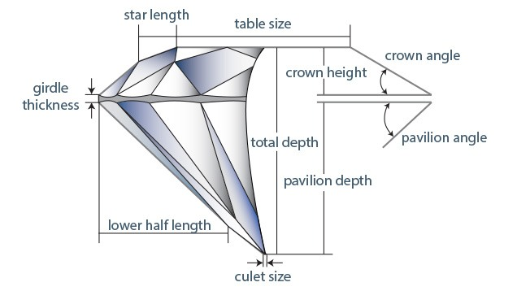

# <font color='navy'> PREDICTING DIAMOND PRICES </font>

## Get data

### 1. Importing all libraries


```python
import pandas as pd
import numpy as np
import matplotlib.pyplot as plt
import seaborn as sns
%matplotlib inline

from sklearn import preprocessing
```

### 2. Getting the data
* Data from pricescope


```python
df = pd.read_csv("pricescope1.csv")
df.drop('Unnamed: 0', axis=1, inplace=True)
display(df.head(3))
```


<div>
<style scoped>
    .dataframe tbody tr th:only-of-type {
        vertical-align: middle;
    }

    .dataframe tbody tr th {
        vertical-align: top;
    }

    .dataframe thead th {
        text-align: right;
    }
</style>
<table border="1" class="dataframe">
  <thead>
    <tr style="text-align: right;">
      <th></th>
      <th>carat</th>
      <th>cut</th>
      <th>color</th>
      <th>clarity</th>
      <th>depth</th>
      <th>table</th>
      <th>lab</th>
      <th>sym</th>
      <th>pol</th>
      <th>flr</th>
      <th>hna</th>
      <th>price</th>
    </tr>
  </thead>
  <tbody>
    <tr>
      <td>0</td>
      <td>1.04</td>
      <td>Premium</td>
      <td>F</td>
      <td>VS1</td>
      <td>61.9</td>
      <td>56</td>
      <td>GIA</td>
      <td>X</td>
      <td>X</td>
      <td>NaN</td>
      <td>N</td>
      <td>$9,191</td>
    </tr>
    <tr>
      <td>1</td>
      <td>1.04</td>
      <td>Premium</td>
      <td>H</td>
      <td>VS2</td>
      <td>61.2</td>
      <td>57</td>
      <td>GIA</td>
      <td>X</td>
      <td>X</td>
      <td>NaN</td>
      <td>N</td>
      <td>$6,786</td>
    </tr>
    <tr>
      <td>2</td>
      <td>1.01</td>
      <td>Premium</td>
      <td>G</td>
      <td>VS2</td>
      <td>61.7</td>
      <td>56</td>
      <td>GIA</td>
      <td>X</td>
      <td>X</td>
      <td>NaN</td>
      <td>N</td>
      <td>$7,465</td>
    </tr>
  </tbody>
</table>
</div>


### Convert price in dollars to integer
1. replace $ with '<blank>' using regex
2. convert to int using astype()
3. array / series to dataframe using pd.DataFrame


```python
priceint=pd.DataFrame(df['price'].replace('[\$,]', '', regex=True).astype(int))
df.drop(['price'], axis=1, inplace=True)
df['price'] = priceint['price'].values
df.head()
```


<div>
<style scoped>
    .dataframe tbody tr th:only-of-type {
        vertical-align: middle;
    }

    .dataframe tbody tr th {
        vertical-align: top;
    }

    .dataframe thead th {
        text-align: right;
    }
</style>
<table border="1" class="dataframe">
  <thead>
    <tr style="text-align: right;">
      <th></th>
      <th>carat</th>
      <th>cut</th>
      <th>color</th>
      <th>clarity</th>
      <th>depth</th>
      <th>table</th>
      <th>lab</th>
      <th>sym</th>
      <th>pol</th>
      <th>flr</th>
      <th>hna</th>
      <th>price</th>
    </tr>
  </thead>
  <tbody>
    <tr>
      <td>0</td>
      <td>1.04</td>
      <td>Premium</td>
      <td>F</td>
      <td>VS1</td>
      <td>61.9</td>
      <td>56</td>
      <td>GIA</td>
      <td>X</td>
      <td>X</td>
      <td>NaN</td>
      <td>N</td>
      <td>9191</td>
    </tr>
    <tr>
      <td>1</td>
      <td>1.04</td>
      <td>Premium</td>
      <td>H</td>
      <td>VS2</td>
      <td>61.2</td>
      <td>57</td>
      <td>GIA</td>
      <td>X</td>
      <td>X</td>
      <td>NaN</td>
      <td>N</td>
      <td>6786</td>
    </tr>
    <tr>
      <td>2</td>
      <td>1.01</td>
      <td>Premium</td>
      <td>G</td>
      <td>VS2</td>
      <td>61.7</td>
      <td>56</td>
      <td>GIA</td>
      <td>X</td>
      <td>X</td>
      <td>NaN</td>
      <td>N</td>
      <td>7465</td>
    </tr>
    <tr>
      <td>3</td>
      <td>0.64</td>
      <td>Premium</td>
      <td>F</td>
      <td>VS2</td>
      <td>60.4</td>
      <td>58</td>
      <td>GIA</td>
      <td>X</td>
      <td>X</td>
      <td>NaN</td>
      <td>N</td>
      <td>1936</td>
    </tr>
    <tr>
      <td>4</td>
      <td>0.84</td>
      <td>Premium</td>
      <td>G</td>
      <td>VS2</td>
      <td>61.6</td>
      <td>57</td>
      <td>GIA</td>
      <td>X</td>
      <td>X</td>
      <td>NaN</td>
      <td>N</td>
      <td>3973</td>
    </tr>
  </tbody>
</table>
</div>


## <a id='data_proc'> Data pre-processing</a>

### Check if any null values present


```python
df.isnull().sum()
```


    carat      0
    cut        0
    color      0
    clarity    0
    depth      0
    table      0
    lab        0
    sym        0
    pol        0
    flr        6
    hna        0
    price      0
    dtype: int64


#### We see that Flouro has empty values. Lets see how many empty and get rid of that data if less than 0.5%


```python
df['flr'].isnull().sum() / len(df['flr']) *100
```


    0.4240282685512367


#### Null values are less 0.5%. so delete those


```python
indexnames = df[df['flr'].isnull()].index
indexnames
df.drop(axis=0,index=indexnames,inplace=True)
df.isnull().sum()
```


    carat      0
    cut        0
    color      0
    clarity    0
    depth      0
    table      0
    lab        0
    sym        0
    pol        0
    flr        0
    hna        0
    price      0
    dtype: int64


```python

```

### Check if all expected datatypes in all columns


```python
df.info()
```

    <class 'pandas.core.frame.DataFrame'>
    Int64Index: 1409 entries, 6 to 1414
    Data columns (total 12 columns):
    carat      1409 non-null float64
    cut        1409 non-null object
    color      1409 non-null object
    clarity    1409 non-null object
    depth      1409 non-null object
    table      1409 non-null object
    lab        1409 non-null object
    sym        1409 non-null object
    pol        1409 non-null object
    flr        1409 non-null object
    hna        1409 non-null object
    price      1409 non-null int32
    dtypes: float64(1), int32(1), object(10)
    memory usage: 137.6+ KB
    

#### We can see depth, table are _object_ datatype. This means there are some string values present. Lets examine and convert to numeric


```python
print('Percent of non-numeric data in Table -->', len([x for x in df['table'] if not x.isnumeric()]) / len(df['table'])*100)
print('Percent of non-numeric data in Depth -->', len([x for x in df['depth'] if not x.isnumeric()]) / len(df['table'])*100)

```

    Percent of non-numeric data in Table --> 5.25195173882186
    Percent of non-numeric data in Depth --> 92.902767920511
    

#### Now see if these are floats stored as string or some rubbish values.


```python
def removenotnum(list1):
    notnum = []
    for x in list1:
        try:
            float(x)
        except:
            notnum.append(x)
    return notnum

notnumtable = removenotnum(df['table'])
print('all rubish values -->', set(notnumtable))
print('Percent of identified rubbish data in Table -->', len(notnumtable) / len(df['table'])*100)

notnumdepth = removenotnum(df['depth'])
print('all rubish values -->', set(notnumtable))
print('Percent of identified rubbish data in Depth -->', len(notnumdepth) / len(df['depth'])*100)

```

    all rubish values --> {'-'}
    Percent of identified rubbish data in Table --> 0.07097232079488999
    all rubish values --> {'-'}
    Percent of identified rubbish data in Depth --> 0.07097232079488999
    

#### It seems only a single type of rubbish character is stored at 0.5% of data, we can remove those entire rows for now
<font color = "green"> 1. Drop rows with rubbish values for Table and Depth </font


```python
indexnames = df[(df['table'] == '-') | (df['depth'] == '-')].index
indexnames
df.drop(axis=0,index=indexnames,inplace=True) 
df.isnull().sum()
print('Percent of identified rubbish data in Table -->', len(removenotnum(df['table'])) / len(df['table'])*100)
```

    Percent of identified rubbish data in Table --> 0.0
    


```python
# This SET statement shows whether any '-' still remaining or not
set(df['depth']=="-")
```


    {False}


### List all categories of the categorical columns: cut, clarity, color, lab, sym, pol, flr, hna
> Remember, making a SET out of a series in a way means finding unique values, since a SET can have only unique values 


```python
print("Cut: ",set(df["cut"]))
print("Color: ",set(df["color"]))
print("Clarity: ",set(df["clarity"]))
print("Lab: ",set(df["lab"]))
print("Symetry: ",set(df["sym"]))
print("Polish: ",set(df["pol"]))
print("Flouro: ",set(df["flr"]))
print("H&A: ",set(df["hna"]))

```

    Cut:  {'Premium', 'Good', 'None', 'Ideal', 'Very Good'}
    Color:  {'D', 'G', 'F', 'I', 'E', 'H'}
    Clarity:  {'VVS1', 'SI1', 'VVS2', 'VS2', 'IF', 'VS1'}
    Lab:  {'GIA', 'AGS'}
    Symetry:  {'G', 'VG', 'F', 'X', 'ID'}
    Polish:  {'G', 'VG', 'F', 'X', 'ID'}
    Flouro:  {'S', 'N', 'F', 'M'}
    H&A:  {'Y', 'N'}
    

### Convert object datatyped table and depth to float


```python
df['table'] = df['table'].astype(float)
df['depth'] = df['depth'].astype(float)
```


```python
df.info()
```

    <class 'pandas.core.frame.DataFrame'>
    Int64Index: 1408 entries, 6 to 1414
    Data columns (total 12 columns):
    carat      1408 non-null float64
    cut        1408 non-null object
    color      1408 non-null object
    clarity    1408 non-null object
    depth      1408 non-null float64
    table      1408 non-null float64
    lab        1408 non-null object
    sym        1408 non-null object
    pol        1408 non-null object
    flr        1408 non-null object
    hna        1408 non-null object
    price      1408 non-null int32
    dtypes: float64(3), int32(1), object(8)
    memory usage: 137.5+ KB
    


```python

```

## <a id='data_viz'>Data visualisation</a>

#### 1. Pair-Plot Price vs. 4 Cs.
Read more about 4Cs at https://4cs.gia.edu/en-us/4cs-diamond-quality/ or video at https://www.diamonds.pro/education/4cs-diamonds/


```python
#df['size']=df['l']*df['w']*df['d']
sns.pairplot(df, x_vars=['carat', 'cut', 'clarity', 'color'], y_vars = ['price'])
plt.show()
#df.drop(['size'], axis=1, inplace=True)
```


#### 2. Convert categorical column to numerical column using labelencoder


```python
def convert_catg(df1):
    from sklearn.preprocessing import LabelEncoder
    le = LabelEncoder()
    # Find the columns of object type along with their column index
    object_cols = list(df1.select_dtypes(exclude=[np.number]).columns)
    object_cols_ind = []
    for col in object_cols:
        object_cols_ind.append(df1.columns.get_loc(col))

    # Encode the categorical columns with numbers    
    for i in object_cols_ind:
        df1.iloc[:,i] = le.fit_transform(df1.iloc[:,i])

convert_catg(df)
df.head(3)


```


<div>
<style scoped>
    .dataframe tbody tr th:only-of-type {
        vertical-align: middle;
    }

    .dataframe tbody tr th {
        vertical-align: top;
    }

    .dataframe thead th {
        text-align: right;
    }
</style>
<table border="1" class="dataframe">
  <thead>
    <tr style="text-align: right;">
      <th></th>
      <th>carat</th>
      <th>cut</th>
      <th>color</th>
      <th>clarity</th>
      <th>depth</th>
      <th>table</th>
      <th>lab</th>
      <th>sym</th>
      <th>pol</th>
      <th>flr</th>
      <th>hna</th>
      <th>price</th>
    </tr>
  </thead>
  <tbody>
    <tr>
      <td>6</td>
      <td>0.40</td>
      <td>3</td>
      <td>3</td>
      <td>2</td>
      <td>61.6</td>
      <td>56.0</td>
      <td>1</td>
      <td>4</td>
      <td>4</td>
      <td>2</td>
      <td>0</td>
      <td>1191</td>
    </tr>
    <tr>
      <td>7</td>
      <td>0.81</td>
      <td>1</td>
      <td>3</td>
      <td>3</td>
      <td>61.6</td>
      <td>57.0</td>
      <td>0</td>
      <td>2</td>
      <td>2</td>
      <td>2</td>
      <td>1</td>
      <td>4391</td>
    </tr>
    <tr>
      <td>8</td>
      <td>0.81</td>
      <td>1</td>
      <td>3</td>
      <td>3</td>
      <td>61.0</td>
      <td>57.0</td>
      <td>0</td>
      <td>2</td>
      <td>2</td>
      <td>2</td>
      <td>1</td>
      <td>4396</td>
    </tr>
  </tbody>
</table>
</div>


#### 3. Plot histogram for every feature including price

* Define histplot function


```python
def histplot(df, listvar, bins):
    fig, axes = plt.subplots(nrows=1, ncols=len(listvar), figsize=(20, 3))
    counter=0
    for ax in axes:
        df.hist(column=listvar[counter], bins=bins, ax=axes[counter])
        plt.ylabel('Price')
        plt.xlabel(listvar[counter])
        counter = counter+1
    plt.show()

```

* plot histogram for every feature now


```python
linear_vars = df.select_dtypes(include=[np.number]).columns
histplot(df,linear_vars[0:4], bins=10)
histplot(df,linear_vars[4:8], bins=10)
histplot(df,linear_vars[8:], bins=10)
```


#### 4. View outliers


```python
def sorteddf(df, listvar):
    for var in listvar:
        display('sorted by ' + var + ' --> ' + str(list(df[listvar].sort_values(by=var,ascending=False)[var].head())))

sorteddf(df, linear_vars)      
```


    'sorted by carat --> [1.05, 1.05, 1.05, 1.05, 1.05]'


    'sorted by cut --> [4, 4, 4, 4, 3]'


    'sorted by color --> [5, 5, 5, 5, 5]'


    'sorted by clarity --> [5, 5, 5, 5, 5]'


    'sorted by depth --> [64.3, 64.2, 63.4, 63.1, 62.9]'


    'sorted by table --> [61.0, 60.0, 59.0, 59.0, 59.0]'


    'sorted by lab --> [1, 1, 1, 1, 1]'


    'sorted by sym --> [4, 4, 4, 4, 4]'


    'sorted by pol --> [4, 4, 4, 4, 4]'


    'sorted by flr --> [3, 3, 3, 3, 3]'


    'sorted by hna --> [1, 1, 1, 1, 1]'


    'sorted by price --> [16680, 15983, 13859, 12994, 12882]'


Lets visualise those using boxplots


```python
def dfboxplot(df, listvar):
    fig, axes = plt.subplots(nrows=1, ncols=len(listvar), figsize=(20, 3))
    counter=0
    for ax in axes:
        df.boxplot(column=listvar[counter], ax=axes[counter])
        plt.ylabel('Price')
        plt.xlabel(listvar[counter])
        counter = counter+1
    plt.show()

dfboxplot(df, linear_vars)

```


```python

```

<font color = 'navy'><i><b>4. Convert to log</b></i></font>


```python
# this log converts dataframe's features inplace
def convertfeatures2log(df, listvars):
    for var in listvars:
        df[var] = np.log(df[var])

convertfeatures2log(df, ['carat', 'depth', 'table', 'price'])
histplot(df,linear_vars[0:4], bins=10)
histplot(df,linear_vars[4:8], bins=10)
histplot(df,linear_vars[8:], bins=10)

```


```python

```

## Data Preprocessing

### 1. Determine mean values of categories of all category columns like cut, clarity and color
* Do a dataframe groupby to find mean. 

* Sort_values sorts result by resulting values, NOT but category label


```python

# Addind a new column in same DF 
# df['price/wt']=df['price']/df['carat']

# IMP: groupby in pandas dataframe
print(df.groupby('cut')['price'].mean().sort_values())
print(df.groupby('color')['price'].mean().sort_values())
print(df.groupby('clarity')['price'].mean().sort_values())

# df = df.drop(['price/wt'], axis=1)

```

    cut
    0    7.433709
    3    7.488936
    1    7.865529
    4    8.158049
    2    8.930626
    Name: price, dtype: float64
    color
    4    7.522740
    3    7.534801
    5    7.546941
    2    7.606852
    1    7.630757
    0    7.706644
    Name: price, dtype: float64
    clarity
    1    7.469443
    3    7.557181
    2    7.571638
    0    7.603729
    5    7.630636
    4    7.734033
    Name: price, dtype: float64
    

### 4. Set X and y now 
* NOTE: two quare brackets [[... ]] are needed to create a datarame. 
* Single [] will create a series / array


```python
X_df = df.drop(['price'], axis=1)
display(X_df.head(3))

y_df = df[['price']] # two [[ to create a DF. Single [] will create a series / array
display(y_df.head(3))
```


<div>
<style scoped>
    .dataframe tbody tr th:only-of-type {
        vertical-align: middle;
    }

    .dataframe tbody tr th {
        vertical-align: top;
    }

    .dataframe thead th {
        text-align: right;
    }
</style>
<table border="1" class="dataframe">
  <thead>
    <tr style="text-align: right;">
      <th></th>
      <th>carat</th>
      <th>cut</th>
      <th>color</th>
      <th>clarity</th>
      <th>depth</th>
      <th>table</th>
      <th>lab</th>
      <th>sym</th>
      <th>pol</th>
      <th>flr</th>
      <th>hna</th>
    </tr>
  </thead>
  <tbody>
    <tr>
      <td>6</td>
      <td>-0.916291</td>
      <td>3</td>
      <td>3</td>
      <td>2</td>
      <td>4.120662</td>
      <td>4.025352</td>
      <td>1</td>
      <td>4</td>
      <td>4</td>
      <td>2</td>
      <td>0</td>
    </tr>
    <tr>
      <td>7</td>
      <td>-0.210721</td>
      <td>1</td>
      <td>3</td>
      <td>3</td>
      <td>4.120662</td>
      <td>4.043051</td>
      <td>0</td>
      <td>2</td>
      <td>2</td>
      <td>2</td>
      <td>1</td>
    </tr>
    <tr>
      <td>8</td>
      <td>-0.210721</td>
      <td>1</td>
      <td>3</td>
      <td>3</td>
      <td>4.110874</td>
      <td>4.043051</td>
      <td>0</td>
      <td>2</td>
      <td>2</td>
      <td>2</td>
      <td>1</td>
    </tr>
  </tbody>
</table>
</div>


<div>
<style scoped>
    .dataframe tbody tr th:only-of-type {
        vertical-align: middle;
    }

    .dataframe tbody tr th {
        vertical-align: top;
    }

    .dataframe thead th {
        text-align: right;
    }
</style>
<table border="1" class="dataframe">
  <thead>
    <tr style="text-align: right;">
      <th></th>
      <th>price</th>
    </tr>
  </thead>
  <tbody>
    <tr>
      <td>6</td>
      <td>7.082549</td>
    </tr>
    <tr>
      <td>7</td>
      <td>8.387312</td>
    </tr>
    <tr>
      <td>8</td>
      <td>8.388450</td>
    </tr>
  </tbody>
</table>
</div>


### 5.  Determine correlation between price vs all other attributes.
* seems price is highly corr with carat (and dimensions) and fairly with color and clarity, not much with cut
* combining both X (already converted categorical to numerical) and y to form a new dataframe for correlation

> * **df_le = X_df** --> df_le will be like a pointer to X_df. Any change made to df_le will actually be a change to X_df
> * So, df_le = X_df.**copy()** is better


```python
df_le = X_df.copy()

# add a new column in dataframe - join 2 dataframe columns-wise
df_le['price'] = y_df['price'].values
df_le.corr()

```


<div>
<style scoped>
    .dataframe tbody tr th:only-of-type {
        vertical-align: middle;
    }

    .dataframe tbody tr th {
        vertical-align: top;
    }

    .dataframe thead th {
        text-align: right;
    }
</style>
<table border="1" class="dataframe">
  <thead>
    <tr style="text-align: right;">
      <th></th>
      <th>carat</th>
      <th>cut</th>
      <th>color</th>
      <th>clarity</th>
      <th>depth</th>
      <th>table</th>
      <th>lab</th>
      <th>sym</th>
      <th>pol</th>
      <th>flr</th>
      <th>hna</th>
      <th>price</th>
    </tr>
  </thead>
  <tbody>
    <tr>
      <td>carat</td>
      <td>1.000000</td>
      <td>-0.227000</td>
      <td>0.102544</td>
      <td>-0.023613</td>
      <td>0.039393</td>
      <td>0.204458</td>
      <td>-0.227405</td>
      <td>-0.237623</td>
      <td>-0.231543</td>
      <td>0.054660</td>
      <td>0.229536</td>
      <td>0.963835</td>
    </tr>
    <tr>
      <td>cut</td>
      <td>-0.227000</td>
      <td>1.000000</td>
      <td>-0.058305</td>
      <td>0.201631</td>
      <td>0.043172</td>
      <td>-0.111751</td>
      <td>0.989376</td>
      <td>0.985790</td>
      <td>0.975246</td>
      <td>-0.208309</td>
      <td>-0.974516</td>
      <td>-0.196432</td>
    </tr>
    <tr>
      <td>color</td>
      <td>0.102544</td>
      <td>-0.058305</td>
      <td>1.000000</td>
      <td>-0.079998</td>
      <td>0.034412</td>
      <td>0.011204</td>
      <td>-0.052867</td>
      <td>-0.060526</td>
      <td>-0.067440</td>
      <td>0.045568</td>
      <td>0.064487</td>
      <td>-0.067419</td>
    </tr>
    <tr>
      <td>clarity</td>
      <td>-0.023613</td>
      <td>0.201631</td>
      <td>-0.079998</td>
      <td>1.000000</td>
      <td>-0.045238</td>
      <td>-0.010072</td>
      <td>0.201366</td>
      <td>0.206650</td>
      <td>0.214137</td>
      <td>-0.028839</td>
      <td>-0.203227</td>
      <td>0.064900</td>
    </tr>
    <tr>
      <td>depth</td>
      <td>0.039393</td>
      <td>0.043172</td>
      <td>0.034412</td>
      <td>-0.045238</td>
      <td>1.000000</td>
      <td>-0.425406</td>
      <td>0.053506</td>
      <td>0.017152</td>
      <td>0.025119</td>
      <td>0.003308</td>
      <td>-0.072570</td>
      <td>0.018577</td>
    </tr>
    <tr>
      <td>table</td>
      <td>0.204458</td>
      <td>-0.111751</td>
      <td>0.011204</td>
      <td>-0.010072</td>
      <td>-0.425406</td>
      <td>1.000000</td>
      <td>-0.112664</td>
      <td>-0.125245</td>
      <td>-0.129512</td>
      <td>-0.019839</td>
      <td>0.133323</td>
      <td>0.174333</td>
    </tr>
    <tr>
      <td>lab</td>
      <td>-0.227405</td>
      <td>0.989376</td>
      <td>-0.052867</td>
      <td>0.201366</td>
      <td>0.053506</td>
      <td>-0.112664</td>
      <td>1.000000</td>
      <td>0.980630</td>
      <td>0.972778</td>
      <td>-0.211673</td>
      <td>-0.984997</td>
      <td>-0.200130</td>
    </tr>
    <tr>
      <td>sym</td>
      <td>-0.237623</td>
      <td>0.985790</td>
      <td>-0.060526</td>
      <td>0.206650</td>
      <td>0.017152</td>
      <td>-0.125245</td>
      <td>0.980630</td>
      <td>1.000000</td>
      <td>0.983955</td>
      <td>-0.195843</td>
      <td>-0.965791</td>
      <td>-0.202796</td>
    </tr>
    <tr>
      <td>pol</td>
      <td>-0.231543</td>
      <td>0.975246</td>
      <td>-0.067440</td>
      <td>0.214137</td>
      <td>0.025119</td>
      <td>-0.129512</td>
      <td>0.972778</td>
      <td>0.983955</td>
      <td>1.000000</td>
      <td>-0.193065</td>
      <td>-0.965360</td>
      <td>-0.193830</td>
    </tr>
    <tr>
      <td>flr</td>
      <td>0.054660</td>
      <td>-0.208309</td>
      <td>0.045568</td>
      <td>-0.028839</td>
      <td>0.003308</td>
      <td>-0.019839</td>
      <td>-0.211673</td>
      <td>-0.195843</td>
      <td>-0.193065</td>
      <td>1.000000</td>
      <td>0.201550</td>
      <td>0.067750</td>
    </tr>
    <tr>
      <td>hna</td>
      <td>0.229536</td>
      <td>-0.974516</td>
      <td>0.064487</td>
      <td>-0.203227</td>
      <td>-0.072570</td>
      <td>0.133323</td>
      <td>-0.984997</td>
      <td>-0.965791</td>
      <td>-0.965360</td>
      <td>0.201550</td>
      <td>1.000000</td>
      <td>0.199534</td>
    </tr>
    <tr>
      <td>price</td>
      <td>0.963835</td>
      <td>-0.196432</td>
      <td>-0.067419</td>
      <td>0.064900</td>
      <td>0.018577</td>
      <td>0.174333</td>
      <td>-0.200130</td>
      <td>-0.202796</td>
      <td>-0.193830</td>
      <td>0.067750</td>
      <td>0.199534</td>
      <td>1.000000</td>
    </tr>
  </tbody>
</table>
</div>



https://www.gia.edu/diamond-cut/diamond-cut-anatomy-round-brilliant

* IDEAL cut has table and depth values along with crown, pavilion, culet etc in a emperically defined range

#### Feature scaling - seems not needed here since we have log1p the price


```python
'''from sklearn.preprocessing import StandardScaler
sc_X = StandardScaler()

 
# why fit_transform to X_train whereas transform to X_test?
# Becasue StandardScaler has to be first fitted to X_train. Then StandardScaler will understand data type and wd need only transform
      
X_df = sc_X.fit_transform(X_df)
X_df[0:3]

'''
```


    'from sklearn.preprocessing import StandardScaler\nsc_X = StandardScaler()\n\n \n# why fit_transform to X_train whereas transform to X_test?\n# Becasue StandardScaler has to be first fitted to X_train. Then StandardScaler will understand data type and wd need only transform\n      \nX_df = sc_X.fit_transform(X_df)\nX_df[0:3]\n\n'


# Run ML Model


#### train test split


```python
from sklearn.model_selection import train_test_split
X_train, X_test, y_train, y_test = train_test_split(X_df, y_df, test_size=0.3, random_state=42)

X_train.head()
```


<div>
<style scoped>
    .dataframe tbody tr th:only-of-type {
        vertical-align: middle;
    }

    .dataframe tbody tr th {
        vertical-align: top;
    }

    .dataframe thead th {
        text-align: right;
    }
</style>
<table border="1" class="dataframe">
  <thead>
    <tr style="text-align: right;">
      <th></th>
      <th>carat</th>
      <th>cut</th>
      <th>color</th>
      <th>clarity</th>
      <th>depth</th>
      <th>table</th>
      <th>lab</th>
      <th>sym</th>
      <th>pol</th>
      <th>flr</th>
      <th>hna</th>
    </tr>
  </thead>
  <tbody>
    <tr>
      <td>1176</td>
      <td>-0.634878</td>
      <td>3</td>
      <td>3</td>
      <td>4</td>
      <td>4.122284</td>
      <td>4.025352</td>
      <td>1</td>
      <td>4</td>
      <td>4</td>
      <td>0</td>
      <td>0</td>
    </tr>
    <tr>
      <td>300</td>
      <td>-0.356675</td>
      <td>3</td>
      <td>3</td>
      <td>2</td>
      <td>4.131961</td>
      <td>4.025352</td>
      <td>1</td>
      <td>4</td>
      <td>4</td>
      <td>2</td>
      <td>0</td>
    </tr>
    <tr>
      <td>1158</td>
      <td>-0.891598</td>
      <td>3</td>
      <td>3</td>
      <td>2</td>
      <td>4.117410</td>
      <td>4.025352</td>
      <td>1</td>
      <td>4</td>
      <td>4</td>
      <td>0</td>
      <td>0</td>
    </tr>
    <tr>
      <td>899</td>
      <td>-0.510826</td>
      <td>1</td>
      <td>1</td>
      <td>3</td>
      <td>4.110874</td>
      <td>4.039536</td>
      <td>0</td>
      <td>2</td>
      <td>2</td>
      <td>2</td>
      <td>1</td>
    </tr>
    <tr>
      <td>780</td>
      <td>-0.186330</td>
      <td>3</td>
      <td>3</td>
      <td>4</td>
      <td>4.125520</td>
      <td>4.043051</td>
      <td>1</td>
      <td>4</td>
      <td>4</td>
      <td>2</td>
      <td>0</td>
    </tr>
  </tbody>
</table>
</div>


```python
# y_test['price'].rename_axis('ID').values
```

### Linear ML model


```python
from sklearn.linear_model import LinearRegression

reg_all = LinearRegression()
reg_all.fit(X_train,y_train)

y_pred=reg_all.predict(X_test)

```


```python
import  matplotlib.pyplot as plt
plt.scatter(y_test,y_pred)
```


    <matplotlib.collections.PathCollection at 0x25221b79dd8>


```python
import seaborn as sns
sns.distplot((y_test-y_pred),bins=20);
```


### Regression Evaluation Metrics


Here are three common evaluation metrics for regression problems:

**Mean Absolute Error** (MAE) is the mean of the absolute value of the errors:

$$\frac 1n\sum_{i=1}^n|y_i-\hat{y}_i|$$

**Mean Squared Error** (MSE) is the mean of the squared errors:

$$\frac 1n\sum_{i=1}^n(y_i-\hat{y}_i)^2$$

**Root Mean Squared Error** (RMSE) is the square root of the mean of the squared errors:

$$\sqrt{\frac 1n\sum_{i=1}^n(y_i-\hat{y}_i)^2}$$

Comparing these metrics:

- **MAE** is the easiest to understand, because it's the average error.
- **MSE** is more popular than MAE, because MSE "punishes" larger errors, which tends to be useful in the real world.
- **RMSE** is even more popular than MSE, because RMSE is interpretable in the "y" units.

All of these are **loss functions**, because we want to minimize them.


```python
from sklearn import metrics

# The following are 

print('MAE:', metrics.mean_absolute_error(y_test, y_pred))
print('MSE:', metrics.mean_squared_error(y_test, y_pred))
print('RMSE:', np.sqrt(metrics.mean_squared_error(y_test, y_pred)))
```

    MAE: 0.11652136924155168
    MSE: 0.02292105733384392
    RMSE: 0.15139701890672722
    

### KNN


```python
X_test.head()
```


<div>
<style scoped>
    .dataframe tbody tr th:only-of-type {
        vertical-align: middle;
    }

    .dataframe tbody tr th {
        vertical-align: top;
    }

    .dataframe thead th {
        text-align: right;
    }
</style>
<table border="1" class="dataframe">
  <thead>
    <tr style="text-align: right;">
      <th></th>
      <th>carat</th>
      <th>cut</th>
      <th>color</th>
      <th>clarity</th>
      <th>depth</th>
      <th>table</th>
      <th>lab</th>
      <th>sym</th>
      <th>pol</th>
      <th>flr</th>
      <th>hna</th>
    </tr>
  </thead>
  <tbody>
    <tr>
      <td>359</td>
      <td>-0.494296</td>
      <td>3</td>
      <td>3</td>
      <td>2</td>
      <td>4.115780</td>
      <td>4.025352</td>
      <td>1</td>
      <td>4</td>
      <td>4</td>
      <td>2</td>
      <td>0</td>
    </tr>
    <tr>
      <td>870</td>
      <td>-0.616186</td>
      <td>3</td>
      <td>4</td>
      <td>3</td>
      <td>4.102643</td>
      <td>4.025352</td>
      <td>1</td>
      <td>4</td>
      <td>4</td>
      <td>2</td>
      <td>0</td>
    </tr>
    <tr>
      <td>1168</td>
      <td>-0.673345</td>
      <td>3</td>
      <td>0</td>
      <td>5</td>
      <td>4.123903</td>
      <td>4.025352</td>
      <td>1</td>
      <td>4</td>
      <td>4</td>
      <td>0</td>
      <td>0</td>
    </tr>
    <tr>
      <td>198</td>
      <td>0.019803</td>
      <td>3</td>
      <td>5</td>
      <td>2</td>
      <td>4.112512</td>
      <td>4.025352</td>
      <td>1</td>
      <td>4</td>
      <td>4</td>
      <td>2</td>
      <td>0</td>
    </tr>
    <tr>
      <td>788</td>
      <td>-0.616186</td>
      <td>3</td>
      <td>2</td>
      <td>5</td>
      <td>4.128746</td>
      <td>4.025352</td>
      <td>1</td>
      <td>4</td>
      <td>4</td>
      <td>2</td>
      <td>0</td>
    </tr>
  </tbody>
</table>
</div>


```python
from sklearn.neighbors import KNeighborsRegressor
from sklearn.model_selection import KFold

reg_all = KNeighborsRegressor(n_neighbors = 3, metric = 'minkowski', p = 2)
kfold = KFold(n_splits=10)
results = cross_val_score(reg_all, X_train, y_train, cv=kfold)
print("Results: %.2f (%.2f) MSE" % (results.mean(), results.std()))


```

    Results: 0.77 (0.04) MSE
    


```python
y_test.head()
```


<div>
<style scoped>
    .dataframe tbody tr th:only-of-type {
        vertical-align: middle;
    }

    .dataframe tbody tr th {
        vertical-align: top;
    }

    .dataframe thead th {
        text-align: right;
    }
</style>
<table border="1" class="dataframe">
  <thead>
    <tr style="text-align: right;">
      <th></th>
      <th>price</th>
    </tr>
  </thead>
  <tbody>
    <tr>
      <td>359</td>
      <td>7.863651</td>
    </tr>
    <tr>
      <td>870</td>
      <td>7.531016</td>
    </tr>
    <tr>
      <td>1168</td>
      <td>7.869784</td>
    </tr>
    <tr>
      <td>198</td>
      <td>8.826735</td>
    </tr>
    <tr>
      <td>788</td>
      <td>7.843064</td>
    </tr>
  </tbody>
</table>
</div>


```python
sns.distplot(y_test-y_pred,bins=20)

```


    <matplotlib.axes._subplots.AxesSubplot at 0x252310bf7b8>


```python
plt.scatter(y_test,y_pred)
```


    <matplotlib.collections.PathCollection at 0x2523117a6d8>


```python
print('MAE:', metrics.mean_absolute_error(y_test, y_pred))
print('MSE:', metrics.mean_squared_error(y_test, y_pred))
print('RMSE:', np.sqrt(metrics.mean_squared_error(y_test, y_pred)))
```

    MAE: 0.2453726742095868
    MSE: 0.13443692717163525
    RMSE: 0.3666564156968145
    


```python

```

### Polynomial regression


```python
from sklearn.preprocessing import PolynomialFeatures
poly = PolynomialFeatures(degree = 2)
X_train_poly = poly.fit_transform(X_train)
X_test_poly = poly.fit_transform(X_test)

reg_all = LinearRegression()
reg_all.fit(X_train_poly,y_train)
y_pred=reg_all.predict(X_test_poly)
```


```python
plt.scatter(y_test,y_pred)
```


    <matplotlib.collections.PathCollection at 0x2522b53c1d0>


```python
print('MAE:', metrics.mean_absolute_error(y_test, y_pred))
print('MSE:', metrics.mean_squared_error(y_test, y_pred))
print('RMSE:', np.sqrt(metrics.mean_squared_error(y_test, y_pred)))
```

    MAE: 898726.9045508087
    MSE: 69247544326063.85
    RMSE: 8321510.94009158
    

### SVM support vector machines


```python
from sklearn.svm import SVR

regressor = SVR(kernel='rbf')
regressor.fit(X_train,y_train)
y_pred = regressor.predict(X_test)

```

    c:\program files\python37\lib\site-packages\sklearn\utils\validation.py:724: DataConversionWarning: A column-vector y was passed when a 1d array was expected. Please change the shape of y to (n_samples, ), for example using ravel().
      y = column_or_1d(y, warn=True)
    c:\program files\python37\lib\site-packages\sklearn\svm\base.py:193: FutureWarning: The default value of gamma will change from 'auto' to 'scale' in version 0.22 to account better for unscaled features. Set gamma explicitly to 'auto' or 'scale' to avoid this warning.
      "avoid this warning.", FutureWarning)
    


```python
print('MAE:', metrics.mean_absolute_error(y_test, y_pred))
print('MSE:', metrics.mean_squared_error(y_test, y_pred))
print('RMSE:', np.sqrt(metrics.mean_squared_error(y_test, y_pred)))
```

    MAE: 0.11289679119235742
    MSE: 0.02766726274929755
    RMSE: 0.16633479115716457
    

### Random forest


```python
from sklearn.ensemble import RandomForestRegressor
rf = RandomForestRegressor(n_estimators = 10)
rf.fit(X_train,y_train)
y_pred = rf.predict(X_test)

```

    c:\program files\python37\lib\site-packages\ipykernel_launcher.py:3: DataConversionWarning: A column-vector y was passed when a 1d array was expected. Please change the shape of y to (n_samples,), for example using ravel().
      This is separate from the ipykernel package so we can avoid doing imports until
    


```python
plt.scatter(y_test,y_pred)
```


    <matplotlib.collections.PathCollection at 0x2522aebd748>


```python
print('MAE:', metrics.mean_absolute_error(y_test, y_pred))
print('MSE:', metrics.mean_squared_error(y_test, y_pred))
print('RMSE:', np.sqrt(metrics.mean_squared_error(y_test, y_pred)))
```

    MAE: 0.06967070893162644
    MSE: 0.01118751456392355
    RMSE: 0.10577104785300914
    

### Neural network


```python
from keras.models import Sequential, model_from_json
from keras.layers import Dense
from keras.optimizers import RMSprop

from keras.wrappers.scikit_learn import KerasRegressor
from sklearn.model_selection import cross_val_score
from sklearn.model_selection import KFold
from sklearn.preprocessing import StandardScaler
from sklearn.pipeline import Pipeline

```

#### Check whether you have tensorflow-gpu?
https://medium.com/@kegui/how-do-i-know-i-am-running-keras-model-on-gpu-a9cdcc24f986


```python
from tensorflow.python.client import device_lib
print(device_lib.list_local_devices())
```

    [name: "/device:CPU:0"
    device_type: "CPU"
    memory_limit: 268435456
    locality {
    }
    incarnation: 634542309881461100
    ]
    

#### https://keras.io/scikit-learn-api/
#### https://www.programcreek.com/python/example/88638/keras.wrappers.scikit_learn.KerasRegressor
1. construct, compile and return a Keras model, which will then be used to fit/predict.
2. Predict diamond prices
3. ypred vs. ytest now


```python

# define base model
def baseline_model():
    # create model
    model = Sequential()
    # add 1st layer
    model.add(Dense(output_dim=18, input_dim=11, activation='relu')) # kernel_initializer='normal',
    # add hidden layer
    model.add(Dense(output_dim=12, kernel_initializer='normal', activation='relu'))
    # add output layer
    model.add(Dense(1, kernel_initializer='normal'))
    # Compile model
    model.compile(loss='mean_squared_error', optimizer='adam')
    return model


```

https://machinelearningmastery.com/5-step-life-cycle-neural-network-models-keras/
# create model
model = Sequential()
# add 1st layer
model.add(Dense(output_dim=18, input_dim=11, kernel_initializer="normal", activation='relu')) # kernel_initializer='normal',
# add hidden layer
model.add(Dense(output_dim=12, kernel_initializer='normal', activation='relu'))
# add output layer
model.add(Dense(output_dim=1, kernel_initializer="normal"))
# Compile model
model.compile(loss='mean_squared_error', optimizer='adam')

history = model.fit(X_train, y_train, epochs=10, batch_size=5)
# 4. evaluate the network
# 5. make predictions
probabilities = model.predict(X_test)
predictions = [float(x) for x in probabilities]
accuracy = np.mean(predictions == y_test)
print("Prediction Accuracy: %.2f%%" % (accuracy*100))loss, accuracy = model.evaluate(X_train, y_train)
print("\nLoss: %.2f, Accuracy: %.2f%%" % (loss, accuracy*100))

```python
estimator = KerasRegressor(build_fn=baseline_model, epochs=10, batch_size=2)

kfold = KFold(n_splits=5)
results = cross_val_score(estimator, X_train, y_train, cv=kfold)
print("Results: %.2f (%.2f) MSE" % (results.mean(), results.std()))
```

    c:\program files\python37\lib\site-packages\ipykernel_launcher.py:6: UserWarning: Update your `Dense` call to the Keras 2 API: `Dense(input_dim=11, activation="relu", units=18)`
      
    c:\program files\python37\lib\site-packages\ipykernel_launcher.py:8: UserWarning: Update your `Dense` call to the Keras 2 API: `Dense(kernel_initializer="normal", activation="relu", units=12)`
      
    

    Epoch 1/10
    788/788 [==============================] - 0s 422us/step - loss: 14.4936
    Epoch 2/10
    788/788 [==============================] - 0s 362us/step - loss: 1.0835
    Epoch 3/10
    788/788 [==============================] - 0s 358us/step - loss: 0.6221
    Epoch 4/10
    788/788 [==============================] - 0s 372us/step - loss: 0.2955
    Epoch 5/10
    788/788 [==============================] - 0s 357us/step - loss: 0.1042
    Epoch 6/10
    788/788 [==============================] - 0s 365us/step - loss: 0.0470
    Epoch 7/10
    788/788 [==============================] - 0s 362us/step - loss: 0.0356
    Epoch 8/10
    788/788 [==============================] - 0s 376us/step - loss: 0.0334
    Epoch 9/10
    788/788 [==============================] - 0s 384us/step - loss: 0.0340
    Epoch 10/10
    788/788 [==============================] - 0s 428us/step - loss: 0.0330
    197/197 [==============================] - 0s 268us/step
    Epoch 1/10
    788/788 [==============================] - 0s 451us/step - loss: 8.2042
    Epoch 2/10
    788/788 [==============================] - 0s 419us/step - loss: 0.5918
    Epoch 3/10
    788/788 [==============================] - 0s 400us/step - loss: 0.2657
    Epoch 4/10
    788/788 [==============================] - 0s 343us/step - loss: 0.0990
    Epoch 5/10
    788/788 [==============================] - 0s 351us/step - loss: 0.0453
    Epoch 6/10
    788/788 [==============================] - 0s 353us/step - loss: 0.0371
    Epoch 7/10
    788/788 [==============================] - 0s 356us/step - loss: 0.0329
    Epoch 8/10
    788/788 [==============================] - 0s 367us/step - loss: 0.0363
    Epoch 9/10
    788/788 [==============================] - 0s 363us/step - loss: 0.0327
    Epoch 10/10
    788/788 [==============================] - 0s 355us/step - loss: 0.0320
    197/197 [==============================] - 0s 203us/step
    Epoch 1/10
    788/788 [==============================] - 0s 406us/step - loss: 15.1731
    Epoch 2/10
    788/788 [==============================] - 0s 334us/step - loss: 0.9675
    Epoch 3/10
    788/788 [==============================] - 0s 325us/step - loss: 0.5895
    Epoch 4/10
    788/788 [==============================] - 0s 335us/step - loss: 0.3408
    Epoch 5/10
    788/788 [==============================] - 0s 342us/step - loss: 0.1639
    Epoch 6/10
    788/788 [==============================] - 0s 332us/step - loss: 0.0629
    Epoch 7/10
    788/788 [==============================] - 0s 331us/step - loss: 0.0319
    Epoch 8/10
    788/788 [==============================] - 0s 333us/step - loss: 0.0273
    Epoch 9/10
    788/788 [==============================] - 0s 377us/step - loss: 0.0274
    Epoch 10/10
    788/788 [==============================] - 0s 332us/step - loss: 0.0275
    197/197 [==============================] - 0s 197us/step
    Epoch 1/10
    788/788 [==============================] - 0s 489us/step - loss: 10.7153
    Epoch 2/10
    788/788 [==============================] - 0s 395us/step - loss: 0.5442
    Epoch 3/10
    788/788 [==============================] - 0s 328us/step - loss: 0.2449
    Epoch 4/10
    788/788 [==============================] - 0s 338us/step - loss: 0.0921
    Epoch 5/10
    788/788 [==============================] - 0s 331us/step - loss: 0.0389
    Epoch 6/10
    788/788 [==============================] - 0s 335us/step - loss: 0.0303
    Epoch 7/10
    788/788 [==============================] - 0s 333us/step - loss: 0.0282
    Epoch 8/10
    788/788 [==============================] - 0s 338us/step - loss: 0.0304
    Epoch 9/10
    788/788 [==============================] - 0s 336us/step - loss: 0.0281
    Epoch 10/10
    788/788 [==============================] - 0s 390us/step - loss: 0.0288
    197/197 [==============================] - 0s 213us/step
    Epoch 1/10
    788/788 [==============================] - 0s 462us/step - loss: 10.88060s - loss: 10.98
    Epoch 2/10
    788/788 [==============================] - 0s 383us/step - loss: 0.7326
    Epoch 3/10
    788/788 [==============================] - 0s 332us/step - loss: 0.3116
    Epoch 4/10
    788/788 [==============================] - 0s 338us/step - loss: 0.1281
    Epoch 5/10
    788/788 [==============================] - 0s 341us/step - loss: 0.0511
    Epoch 6/10
    788/788 [==============================] - 0s 329us/step - loss: 0.0329
    Epoch 7/10
    788/788 [==============================] - 0s 343us/step - loss: 0.0326 0s - loss: 0.03
    Epoch 8/10
    788/788 [==============================] - 0s 347us/step - loss: 0.0304
    Epoch 9/10
    788/788 [==============================] - 0s 361us/step - loss: 0.0329
    Epoch 10/10
    788/788 [==============================] - 0s 352us/step - loss: 0.0350
    197/197 [==============================] - 0s 214us/step
    Results: -0.03 (0.01) MSE
    


```python

```


```python
estimator.fit(X_train, y_train)
y_pred = estimator.predict(X_test)
y_pred[0:5]

plt.scatter(y_test,y_pred)
#accuracy_score(y_test, prediction)

```

    c:\program files\python37\lib\site-packages\ipykernel_launcher.py:6: UserWarning: Update your `Dense` call to the Keras 2 API: `Dense(input_dim=11, activation="relu", units=18)`
      
    c:\program files\python37\lib\site-packages\ipykernel_launcher.py:8: UserWarning: Update your `Dense` call to the Keras 2 API: `Dense(kernel_initializer="normal", activation="relu", units=12)`
      
    

    Epoch 1/10
    985/985 [==============================] - 0s 404us/step - loss: 8.9889
    Epoch 2/10
    985/985 [==============================] - 0s 350us/step - loss: 0.6913
    Epoch 3/10
    985/985 [==============================] - 0s 353us/step - loss: 0.2775
    Epoch 4/10
    985/985 [==============================] - 0s 350us/step - loss: 0.0788
    Epoch 5/10
    985/985 [==============================] - 0s 355us/step - loss: 0.0380
    Epoch 6/10
    985/985 [==============================] - 0s 367us/step - loss: 0.0330
    Epoch 7/10
    985/985 [==============================] - 0s 390us/step - loss: 0.0312
    Epoch 8/10
    985/985 [==============================] - 0s 377us/step - loss: 0.0273
    Epoch 9/10
    985/985 [==============================] - 0s 353us/step - loss: 0.0277
    Epoch 10/10
    985/985 [==============================] - 0s 351us/step - loss: 0.0300
    


    <matplotlib.collections.PathCollection at 0x2522bd346d8>


```python

```
